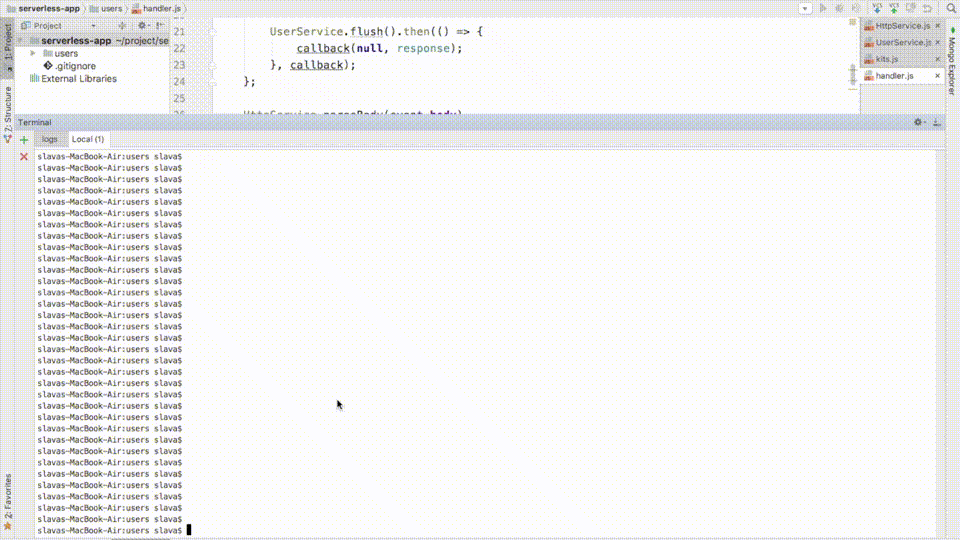

# serverless-app

App pushes POST payload to google spreadsheet.    

Stack:
- [Serverless (AWS)](https://serverless.com/)
- [AWS Lambda](https://aws.amazon.com/documentation/lambda/)
- [Google spreadsheets](https://developers.google.com/sheets/)

[YouTube Video](https://www.youtube.com/watch?v=NnTmtOmoEJQ)

How to setup:
- AWS Sign in [https://console.aws.amazon.com/console/home](https://console.aws.amazon.com/console/home)
- Install Node.js [https://nodejs.org/en/](https://nodejs.org/en/) 
- `npm install serverless -g`
- Follow video to get credentials: [AWS credential setup for Serverless](https://www.youtube.com/watch?v=HSd9uYj2LJA)
- It should lead to: `serverless config credentials --provider aws --key <...AKIAIOSFO..> --secret <....EMI/K7MDENG/bPxRfiCYE...>`
- Setup your app in `users/config/default.js`
	* `serviceKey` it's **Service Account** [follow this instructions](https://www.npmjs.com/package/google-spreadsheet#service-account-recommended-method) 
	* `spreadsheet` __key should be__ docs.google.com/spreadsheets/d/**11Sso5yOjzpF_xxxxV1f24IWwjVl5uZMDNXlbtmXIBFc**/edit#gid=0
	  * Make sure that you have `JSON` column in the google spreadsheet. (First line of spread sheet)
- Install dependencies `cd users && npm install`
- Deployment: `cd users && serverless deploy`
- It will give you endpoint to POST
	* for ex. `https://j66dyaz0de.execute-api.us-east-1.amazonaws.com/dev/users`
- Now you can post and payload will be saved into JSON column.

